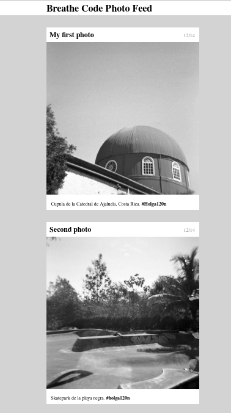

# Simple photo feed

Simple photo feed es parte de un ejercicio del bootcamp, el cual
busca abarcar conceptos como:

* Importar imágenes.
* Utilización de contenedores.
* Reutilización de clases de CSS.

Aquí un ejemplo:

</img>
